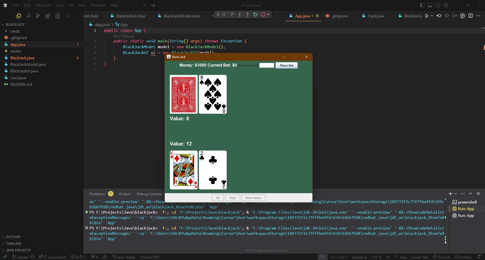

# BlackJack

A Java implementation of the classic BlackJack card game with a graphical user interface.

## Game Demo



## Features

- Full BlackJack game implementation with standard rules
- Clean MVC (Model-View-Controller) architecture
- Graphical user interface using Java Swing
- Real-time card value display for better decision making
- Complete betting system with money management
- Intuitive game flow with Hit, Stay, and New Game options

## Game Mechanics

- **Card Values**: Number cards (2-10) are worth their face value, face cards (J,Q,K) are worth 10, and Aces can be worth 1 or 11
- **Betting**: Place bets before each hand begins
- **Winning**: Beat the dealer's hand without going over 21
- **Payouts**: Win 1:1 on standard wins

## Controls

- **Place Bet**: Enter bet amount and click "Place Bet" to start a hand
- **Hit**: Draw another card
- **Stay**: End your turn and let the dealer play
- **New Game**: Start a new hand after the current one is complete

## Technical Implementation

The project is structured using the MVC pattern:

- **Model**: `BlackJackModel.java` and `Card.java` - Game logic and state
- **View**: `BlackJackUI.java` - User interface and rendering
- **Controller**: `BlackJack.java` - Connects model and view

## Getting Started

### Prerequisites

- Java Development Kit (JDK) 8 or higher

### Running the Game

```bash
javac *.java
java App
```

## License

This project is open source and available for personal and educational use.

## Author

- **Salah Boussettah** - [GitHub](https://github.com/SalahBoussettah)